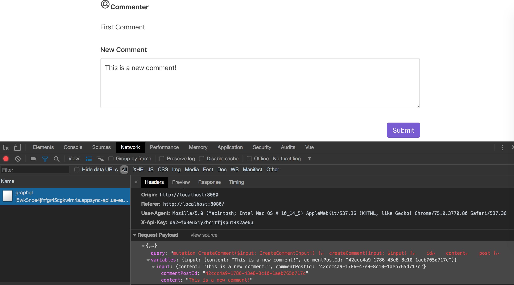
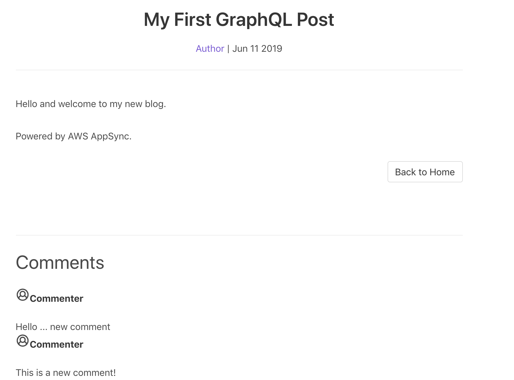

# Full Stack Serverless Apps with AWS AppSync and Amplify Framework

## Mutating Data

In this section, we will continue to expand our simple blog application by adding support for mutations in the frontend application. As you saw in the previous section, our API already supports creating and updating data, adding support to the Vue application is fairly simple.

First, we'll add support for commenting on a post. First, create a new file in the `src/components` directory named `NewComment.vue`. Paste the following code into the new file and save:

### src/components/NewComment.vue

``` js
<template>
  <div class="newComment">
    <b-field label="New Comment">
      <b-input v-model="content" maxlength="200" type="textarea"></b-input>
    </b-field>
    <div class="has-text-right">
      <b-button @click="submitComment" type="is-primary">Submit</b-button>
    </div>
  </div>
</template>

<script>
import { graphqlOperation, Logger } from 'aws-amplify'
import { createComment } from '@/graphql/mutations'

const logger = new Logger('PostDetail')

export default {
  name: 'NewComment',
  props: {
    postId: String
  },
  data: function() {
    return {
      content: ''
    }
  },
  methods: {
    async submitComment() {
      try {
        const newComment = {
          content: this.content,
          commentPostId: this.postId
        }
        await this.$Amplify.API.graphql(graphqlOperation(createComment, { input: newComment }))
        logger.debug('Comment created')
      } catch (error) {
        logger.error(error)
      }
    }
  }
}
</script>

<style>
.newComment {
  padding-top: 30px;
}
</style>
```

We also need to make a few updates to the `PostDetail` page:

### src/views/PostDetail.vue

``` js
<template>
  <div class="post">
    <Post :post="myPost" :key="myPost.id" />
    
    <hr />

    <h3 class="subtitle is-3" v-if="comments.length">Comments</h3>
    <Comment v-for="comment in comments" :comment="comment" :key="comment.id" />

    <!-- ADDED -->
    <NewComment :postId="myPost.id" />
  </div>
</template>

<script>
import Post from '@/components/Post.vue'
import Comment from '@/components/Comment.vue'
import NewComment from '@/components/NewComment.vue' // ADDED

import { graphqlOperation, Logger } from 'aws-amplify'
import { getPost } from '@/graphql/queries'

const logger = new Logger('PostDetail')

export default {
  name: 'PostDetail',
  components: {
    Post,
    Comment,
    NewComment // ADDED
  },
  props: {
    post: Object
  },
  data: function() {
    return {
      myPost: {},
      comments: []
    }
  },
  async mounted() {
    try {
      const postData = await this.$Amplify.API.graphql(
                          graphqlOperation(getPost, { id: this.$route.params.id })
                       )
      logger.debug('data from API: ' + postData)
      this.myPost = postData.data.getPost

      this.comments = this.postHasData() ? this.myPost.comments.items : []
    } catch (error) {
      logger.error(error)
    }
  },
  methods: {
    postHasData() {
      return Array.isArray(this.myPost.comments.items) || this.myPost.comments.items.length
    }
  }
}
</script>
```

Hop back to your browser, open your Develper Tools to the Network tab, and refresh the post detail page. Beneath all comments, there should now be an area to create a new comment. Enter a comment and click "Submit".

In your Developer Tools, you should see a `POST` request to your GraphQL endpoint such as:



Refresh the page to see the new comment, for example:



### A Brief Dive into Resolvers

We've now used a mutation to create a new comment in the Comments DyanmoDB table via AppSync. Thus far, we've relied on Amplify to build the resolvers that connect AppSync and DynamoDB. Resolvers in AppSync are built using the Velocity Template Language (VTL). While a simple resolver, such as the one that puts a new comment in a DynamoDB table, is somewhat boilerplate, we can also build more complex resolvers as needed.

We can find the resolver template used to create a new Comment both in the AWS Management Console and within our Amplify project. In your Amplify project, open the file `amplify/backend/api/MyAmplifyBlog/build/resolvers/Mutation.createComment.req.vtl`, it should look like the following:

``` vtl
$util.qr($context.args.input.put("createdAt", $util.defaultIfNull($ctx.args.input.createdAt, $util.time.nowISO8601())))
$util.qr($context.args.input.put("updatedAt", $util.defaultIfNull($ctx.args.input.updatedAt, $util.time.nowISO8601())))
$util.qr($context.args.input.put("__typename", "Comment"))
{
  "version": "2017-02-28",
  "operation": "PutItem",
  "key": #if( $modelObjectKey ) $util.toJson($modelObjectKey) #else {
  "id":   $util.dynamodb.toDynamoDBJson($util.defaultIfNullOrBlank($ctx.args.input.id, $util.autoId()))
} #end,
  "attributeValues": $util.dynamodb.toMapValuesJson($context.args.input),
  "condition": {
      "expression": "attribute_not_exists(#id)",
      "expressionNames": {
          "#id": "id"
    }
  }
}
```

If you are familiar with using an AWS SDK to put an item in DynamoDB, the latter part of the resolver should look familiar. From line 4 down, we are structuring a `PutItem` request for DynamoDB. Above line 4, we are setting default values for the `createdAt` and `updatedAt` timestamps and setting the GraphQL type value (`__typename`).

The corresponding response template can be found at `amplify/backend/api/MyAmplifyBlog/build/resolvers/Mutation.createComment.res.vtl` and simply converts the response from DynamoDB to JSON using a utility library provided by AppSync.

``` vtl
$util.toJson($context.result)
```

More details on DynamoDB resolver templates for AppSync can be found in [documentation](https://docs.aws.amazon.com/appsync/latest/devguide/resolver-mapping-template-reference-dynamodb.html).

Now that you know where to find the various resolvers for your GraphQL API, review a few others. Amplify has done a significant amount of heavy lifting for us, though we can also provide our own, [custom resolver](https://aws-amplify.github.io/docs/cli/graphql#add-a-custom-resolver-that-targets-a-dynamodb-table-from-model) using an "escape hatch" in Amplify, though that is out of the scope of this workshop.

## Subscribing to Changes in Data

