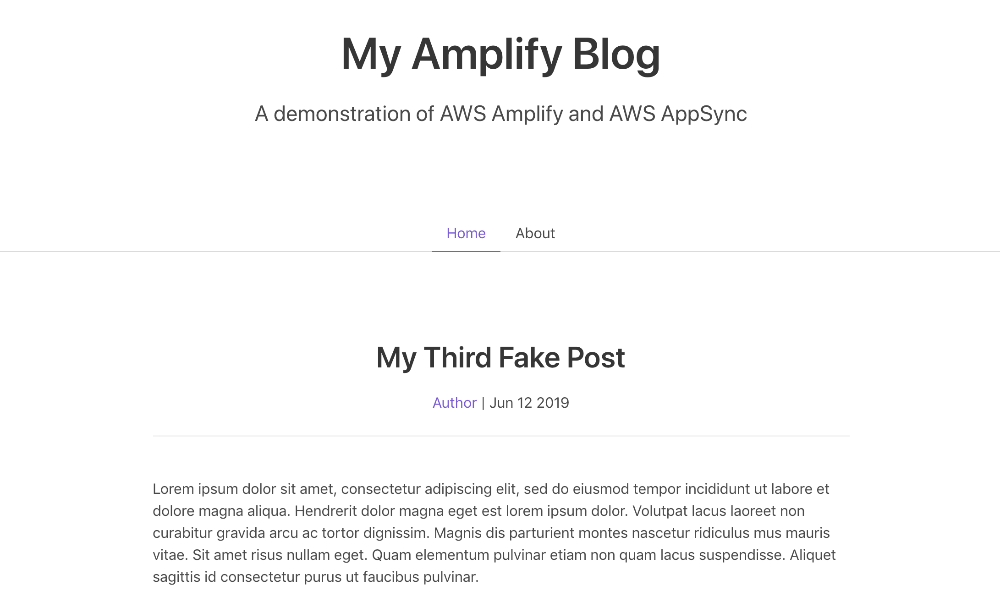
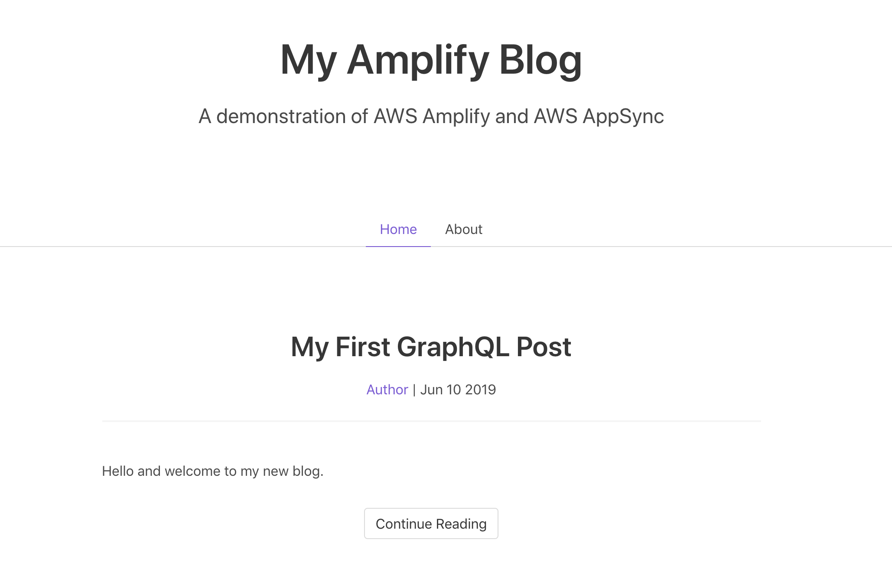

# Full Stack Serverless Apps with AWS AppSync and Amplify Framework

In this workshop we'll learn how to build cloud-enabled applications with GraphQL via [AWS AppSync](https://aws.amazon.com/appsync/), [Vue.js](https://vuejs.org), & [AWS Amplify](https://aws-amplify.github.io/).

## Getting Started - Creating the Vue Application

To get started, we'll clone this repository, which includes a simple but functional blog application that currently uses mock data. Throughout the workshop, we will enhance the application to use AWS AppSync and other cloud services.

> Note: Node.js is required, please install version 8+ ([installation instructions](https://nodejs.org/en/download/)).

``` bash
$ git clone https://github.com/jkahn117/my-amplify-blog-workshop

# You can either modify the starter project or create a copy.
# I suggest making a copy of starter before starting work as shown here...
$ cd my-amplify-blog-workshop

$ cp -r starter mywork

$ cd mywork

# Use NPM to install dependencies
$ npm install
```

After NPM finished installation, we can launch the starter site:

``` bash
$ npm run serve
```

Open your favorite browser and navigate to http://localhost:8080.



## Installing the Amplify CLI & Initializing a new AWS Amplify Project

### Installing the CLI

Next, we'll install the AWS Amplify CLI:

``` bash
$ npm install -g @aws-amplify/cli
```

Now we need to configure the CLI with our credentials:

``` bash
$ amplify configure
```

> If you'd like to see a video walkthrough of this configuration process, click [here](https://www.youtube.com/watch?v=fWbM5DLh25U).

Here we'll walk through the `amplify configure` setup. Once you've signed in to the AWS console, continue:
- Specify the AWS Region: __us-west-2__
- Specify the username of the new IAM user: __amplify-workshop-user__
> In the AWS Console, click __Next: Permissions__, __Next: Tags__, __Next: Review__, & __Create User__ to create the new IAM user. Then, return to the command line & press Enter.
- Enter the access key of the newly created user:   
  accessKeyId: __(<YOUR_ACCESS_KEY_ID>)__   
  secretAccessKey:  __(<YOUR_SECRET_ACCESS_KEY>)__
- Profile Name: __amplify-workshop-user__

### Initializing A New Project

``` bash
$ amplify init
```

- Enter a name for the project: __myamplifyblog__
- Enter a name for the environment: __dev__
- Choose your default editor: __Visual Studio Code (or your default editor)__   
- Please choose the type of app that you're building __javascript__   
- What javascript framework are you using __react__   
- Source Directory Path: __src__   
- Distribution Directory Path: __build__   
- Build Command: __npm run-script build__   
- Start Command: __npm run-script start__   
- Do you want to use an AWS profile? __Y__
- Please choose the profile you want to use: __amplify-workshop-user__

Now, the AWS Amplify CLI has iniatilized a new project & you will see a new folder: __amplify__ & a new file called `aws-export.js` in the __src__ directory. These files hold your project configuration.

## Adding a GraphQL API

To add a GraphQL API, we can use the following command:

``` bash
$ amplify add api
```

Answer the following questions

- Please select from one of the above mentioned services __GraphQL__   
- Provide API name: __MyAmplifyBlog__   
- Choose an authorization type for the API __API key__   
- Do you have an annotated GraphQL schema? __N__   
- Do you want a guided schema creation? __Y__   
- What best describes your project: __One-to-many relationship (e.g., “Blogs” with “Posts” and “Comments”)__   
- Do you want to edit the schema now? (Y/n) __Y__   

Amplify will open the default GraphQL schema with Amplify annotations in your editor. We will modify the GraphQL schema as shown below to slightly simplify it.

> Take a moment to review. Note the use of `@model` and `@connection` as Amplify will transform these next.

```graphql
type Post @model {
  id: ID!
  title: String!
  content: [String]
  comments: [Comment] @connection(name: "PostComments")
}
type Comment @model {
  id: ID!
  content: String
  post: Post @connection(name: "PostComments")
}
```

> Next, let's push the new API to our account:

```bash
amplify push
```

``` bash
Current Environment: dev

| Category | Resource name | Operation | Provider plugin   |
| -------- | ------------- | --------- | ----------------- |
| Api      | MyAmplifyBlog | Create    | awscloudformation |
? Are you sure you want to continue? __Yes__
```

- Do you want to generate code for your newly created GraphQL API __Y__
- Choose the code generation language target: __javascript__
- Enter the file name pattern of graphql queries, mutations and subscriptions: __(src/graphql/**/*.js)__
- Do you want to generate/update all possible GraphQL operations - queries, mutations and subscriptions? __Y__
- Enter maximum statement depth [increase from default if your schema is deeply nested] __2__

> As Amplify pushes the change to AWS, note the various resources being created (e.g. DynamoDB Table, AppSync GraphQLSchema, and various IAM roles).

To view the your newly created AppSync API, you can run the `console` command:

``` bash
$ amplify console api
```

> Once open in your browser, you can click on "Schema" in the left menu to review the GraphQL schema for your API. Amplify has done a lot of work for us to expand the capabilities of our API.

### Exercising the API

AppSync provides a GraphQL editor that you can use to run queries against the API. Click on "Queries" in the left menu. You can also use the GraphQL IDE of your choice.

Let's populate some data by creating a new post using GraphQL. Enter the following in the left pane and click the orange Run button:

``` graphql
mutation CreatePost {
  createPost(input: {
    title: "My First GraphQL Post",
    content: [
      "Hello and welcome to my new blog.",
      "Powered by AWS AppSync."
    ]
  })
  {
    id
    title
  }
}
```

The result of your GraphQL mutation should appear on right. Note that the id is automatically generated, so it will be different than mine. Be sure to save the id value for later.

``` json
{
  "data": {
    "createPost": {
      "id": "34477d37-eecc-4727-9304-16c0d19101e8",
      "name": "My First GraphQL Post"
    }
  }
}
```

Next, let's create our first post comment using a second GraphQL mutation:

``` graphql
mutation CreateComment {
  createComment(input: {
    commentPostId: "34477d37-eecc-4727-9304-16c0d19101e8",
    content: "First Comment"
  })
  {
    id
  }
}
```

The result should look like the following:

``` json
{
  "data": {
    "createComment": {
      "id": "0c205ecd-5f5c-4e85-8ae6-23f6f3feed16"
    }
  }
}
```

> Create a second post using the above mutation as a guide. Change the title of the post to "Second GraphQL Post".

Now that we have some data, let's query for a list of posts and the first post in each:

``` graphql
query ListPost {
  listPosts {
    items {
      id
      title
    }
  }
}
```

Your result should look something like this:

``` json
{
  "data": {
    "listPosts": {
      "items": [
        {
          "title": "My First GraphQL Post",
          "comments": {
            "items": [
              {
                "id": "34477d37-eecc-4727-9304-16c0d19101e8",
                "content": "First Comment"
              }
            ]
          }
        }
      ]
    }
  }
}
```

We can also modify the GraphQL query to only return desired data, for example, if we wanted to retrieve the first comment for this post:

``` graphql
query ListPost {
  listPosts {
    items {
      title
      comments(limit: 1) {
        items {
          content
        }
      }
    }
  }
}
```

The result would look like this:

``` json
{
  "data": {
    "listPosts": {
      "items": [
        {
          "title": "My First GraphQL Post",
          "comments": {
            "items": [
              {
                "content": "First Comment"
              }
            ]
          }
        }
      ]
    }
  }
}
```

> Curious about the underpinnings of this example? Check out the CloudFormation and DynamoDB consoles in your account. Amplify uses CloudFormation to manage your AWS resources and this example uses several DynamoDB tables to store data.

### Configuring the React applicaion

With our GraphQL API in place, let's integrate AWS Amplify and AWS AppSync to make the application dynamic.

> Be sure to press `CTRL+C` to stop the Vue server before moving on.

> Confirm you are working in either the `mywork` or `starter` directory.

Install the AWS Amplify & AWS Amplify Vue libraries ([docs](https://aws-amplify.github.io/docs/js/vue)):

```bash
$ npm install --save aws-amplify aws-amplify-vue
```

The first thing we need to do is to configure our Vue application to be aware of our new AWS Amplify project. We can do this by referencing the auto-generated `aws-exports.js` file that was generated when we pushed our Amplify project to the cloud earlier. This file is now in our `src/` folder.

To configure the app, open __src/main.js__ and add the following code below the last import:

### src/main.js

``` js
import Amplify, * as AmplifyModules from 'aws-amplify'
import { AmplifyPlugin } from 'aws-amplify-vue'
import config from './aws-exports'
Amplify.configure(config)

Vue.use(AmplifyPlugin, AmplifyModules)
```

Now, our app is ready to start using our AWS services. Let's start the Vue test server again:

``` bash
$ npm run serve
```

### Adding the API to Our Application

Now that the GraphQL API is created we can begin interacting with it! Plus, Amplify has already generated the applicable GraphQL code.

The first thing we'll do is perform a query to fetch data from our API.

To do so, we need to define the query, execute the query, then list the items in our UI. Amplify has already generated the `listPosts` GraphQL query, you can find it and other queries at `src/graphql/queries.js`.

### src/views/Home.vue

``` js
<template>
  <div class="home">
    <Post v-for="post in posts" :post="post" :key="post.id" :isSummary="true" />
  </div>
</template>

<script>
import Post from '@/components/Post.vue'

import { graphqlOperation, Logger } from 'aws-amplify'
import { listPosts } from '@/graphql/queries'

const logger = new Logger('Home')

export default {
  name: 'home',
  components: {
    Post
  },
  data: function() {
    return {
      posts: []
    }
  },
  async mounted() {
    try {
      const postData = await this.$Amplify.API.graphql(graphqlOperation(listPosts))
      logger.debug('data from API: ' + postData)
      this.posts = postData.data.listPosts.items
    } catch (error) {
      logger.error(error)
    }
  }
}
</script>
```

After saving your changes, visit the newly updated site in the browser at http://localhost:8080. The page should reload automatically, but you can also refresh manually if not. The page should now be retrieving data from AWS AppSync:



Let's also update the Post Detail page to retrieve data from the GraphQL API. In a more complex application, we may use state (Vuex in the Vue world) to store some of this data locally, so that we do not need to make a server request. Here, we will reach out to the server again.

### src/views/PostDetail.vue

``` js
<template>
  <div class="post">
    <Post :post="myPost" :key="myPost.id" />
    
    <hr />

    <h3 class="subtitle is-3" v-if="comments.length">Comments</h3>
    <Comment v-for="comment in comments" :comment="comment" :key="comment.id" />    
  </div>
</template>

<script>
import Post from '@/components/Post.vue'
import Comment from '@/components/Comment.vue'

import { graphqlOperation, Logger } from 'aws-amplify'
import { getPost } from '@/graphql/queries'

const logger = new Logger('PostDetail')

export default {
  name: 'PostDetail',
  components: {
    Post,
    Comment
  },
  props: {
    post: Object
  },
  data: function() {
    return {
      myPost: {},
      comments: []
    }
  },
  async mounted() {
    try {
      const postData = await this.$Amplify.API.graphql(
                          graphqlOperation(getPost, { id: this.$route.params.id })
                       )
      logger.debug('data from API: ' + postData)
      this.myPost = postData.data.getPost

      this.comments = this.postHasData() ? this.myPost.comments.items : []
    } catch (error) {
      logger.error(error)
    }
  },
  methods: {
    postHasData() {
      return Array.isArray(this.myPost.comments.items) || this.myPost.comments.items.length
    }
  }
}
</script>
```

Save your changes and return to the browser. Click on the "Continue Reading" button beneath one of the posts. You should now see a page showing only the post you selected with any comments just beneath the text.

Now that we have explored GraphQL queries, let's take a look at creating data using GraphQL mutations.

**[Mutating Data >>](./1_Mutations)**